# Drone Analysis App
## Introduction
Welcome to our drone analysis app. This was designed by a group of 6 members: Marki Costa, Roberto Fornez, Hesham Elkaliouby, Sami Op, Manahil Wali, and Chunsheng (Roy) Xiao.

It is built mainly using theory from John D. Anderson's Aircraft Performance and Design textbook. However, we have also used other sources to supplement.

The GitHub can be found here: https://github.com/Hesham-E/DroneAnalysisApp

## Application

The application itself is built using Python and the QT (PySide6) framework. The software architecture of the application is Model, View, Controller and the specific implementation can be followed through the diagram below.

### Developing the Application

In order to develop the application, one must download the QT Creator IDE. Please find the download link here: https://www.qt.io/download-qt-installer-oss. The default options in the installer are fine to use. Next, please install PySide6 through the PIP package manager. In a terminal, enter `pip install pyside6`. This will grab and install the latest package.

Finally, we use the following libraries. The following commands will install them and other prerequisites:
* `pip install pandas`
* `pip install aenum`

Once QT and the libraries specified are installed. One can find the code through the QT Creator IDE and run the program through there.

### Packaging the Application

It is also possible to package the application into an executable through the use of `pyside6-deploy`. When this command is run in the home directory of the project. It will package the files into an executable to be run. However, be wary in that the executable relies on the data (the .csv files) external to it for the airfoil data.

You can read more about `pyside6-deploy` here: https://doc.qt.io/qtforpython-6/deployment/deployment-pyside6-deploy.html.

### Using the Application

The application consists of 5 main screens. These are:

* The Introduction Page
  * This page acts as a splash screen for the user and explains the purpose of the application
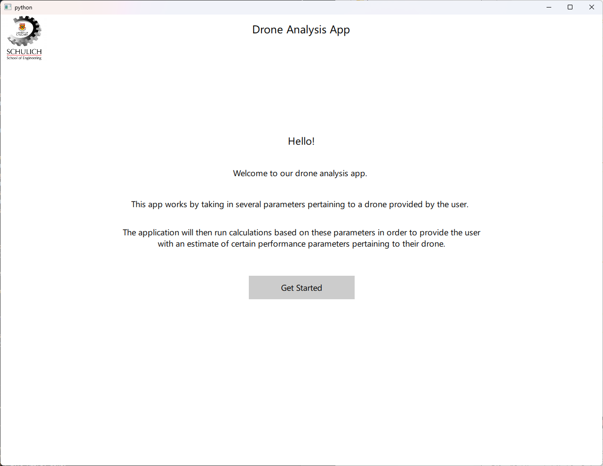
* The Mission Type Page
  * This page allows the user to select from two mission types: surviellance and payload delivery.
  * The difference between these two mission types is that a user can specify a payload weight to be accounted for during missions if they select payload delivery
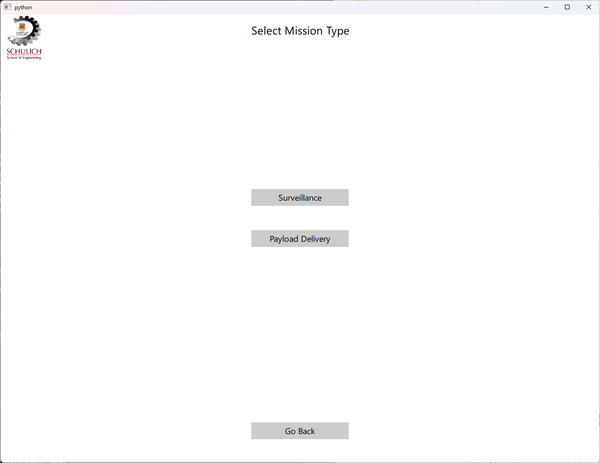
* The Mission Profile Page
  * On this page there are four generic mission profiles which users can choose from depending on what best represents their mission
  * There is also a desired performance profile on this page which toggles between a "as fast as possible" performance mode and a more efficient mode. The difference between these two modes is that the predictive thrust calculations change to either use max thrust at all times or a more conservative one.
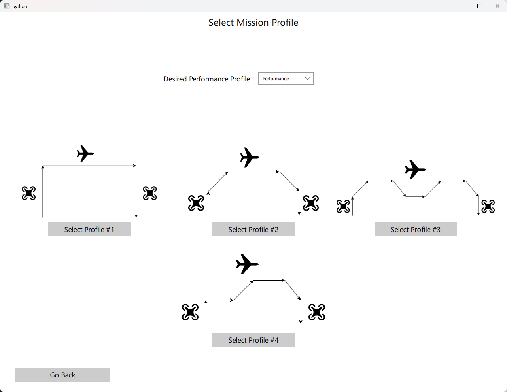
* The Mission Parameters Page
  * Here, users can select their total mission distance and can also specify atmospheric conditions
  * Furthermore, the user can also specify a desired cruise speed to fly at for the duration of the mission
    * NOTE: This overrides the Performance Mode of the perfromance profiles if it is set to a non-zero number
  * Finally, the altitudes at which the drone should fly for the mission are also specified. A user should be wary that altitudes make sense given a mission profile.
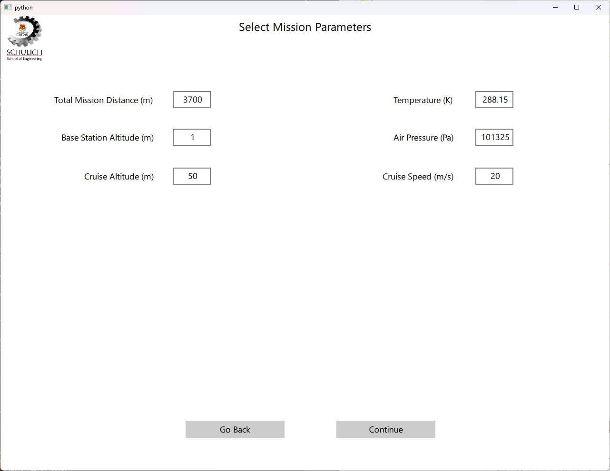
* The Drone Parameters Page
  * Here is where all drone parameters are entered. This is based on physical parameters of the drone as well as the selected motor and propellor configurations.
  * On this page there is also a switch to toggle between "Predict Performance" and "Predict Design"
    * When the toggle is on "Predict Performance", the program behaves normally. It takes in all the drone parameters and processes them once "Generate Results" is clicked
    * When the toggle is on "Predict Design", new text boxes and a legend appear explaining how this feature works. The point of this feature is to allow the program to predict some drone specfications given desired performance parameters.
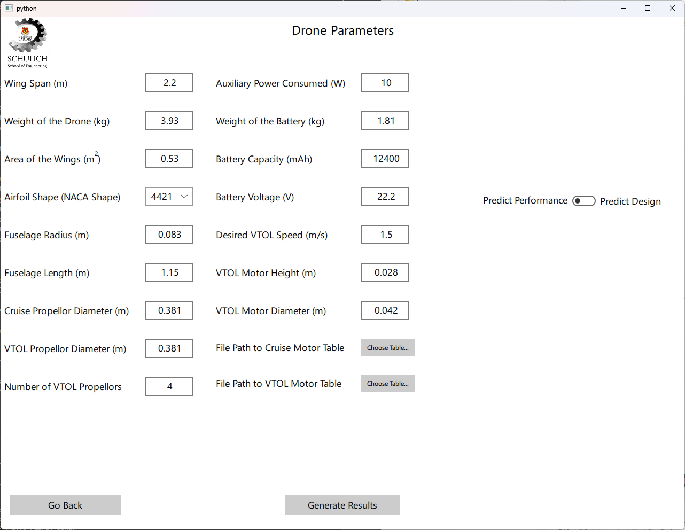
* The Results Page
  * This page contains a summary of all our results in two distinct sections. The General Performance Summary and the Mission Summary.
  * Additionally, there is an "Export Detailed Results" button which generates a CSV file breaking down the predicted flight every 0.1 seconds. This CSV is saved to the same directory as the main(.py/.exe) 
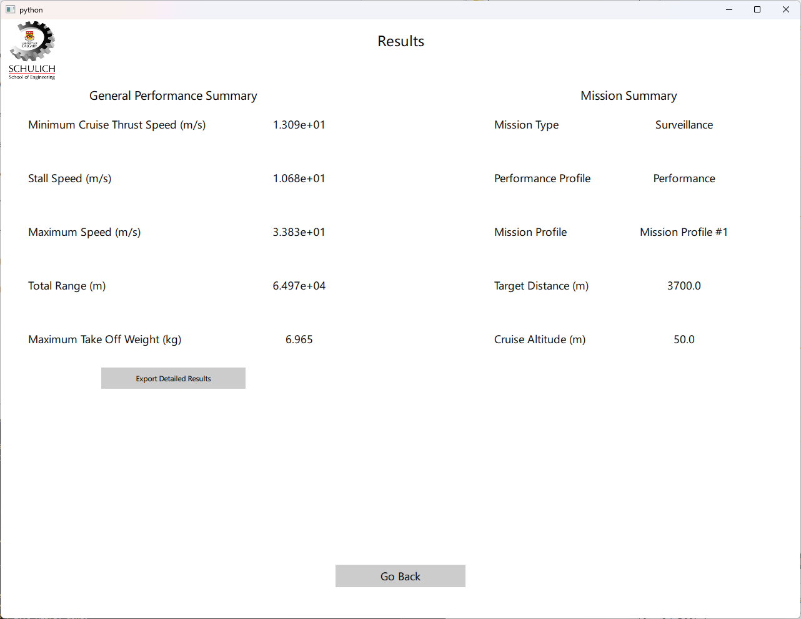

## Power BI Data Visualization Tool
The design team created a Power BI file to complement the CSV results file as a sample of what visualizing the flight would look like. This can be accessed through the `Flight_Simulations.pbix` file. This file allows a user to quickly break down segements of the data and inspect them through the robust Power BI suite of tools.

### How to Use Power BI

#### First Time Use

* Install Power BI thorugh the Microsoft store
* Once installed, open the `Flight_Simulations.pbix` file

#### Regular Use

* On the very far right open the data tab and delete the existing model called “detailedResults”
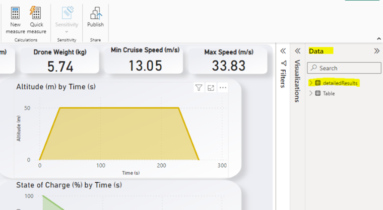
* Delete this connection by right clicking and pressing "delete from model"
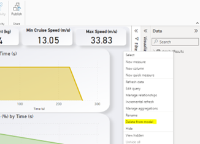
* From here press get data in the top right and select Excel Workbook
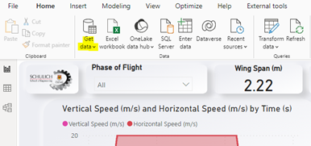
* When selecting a model from the file path make sure you set to all file types to be able to pull in a csv 
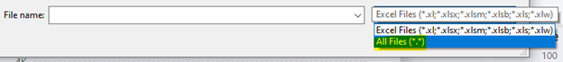
* Look for the detailed results csv that the program outputs
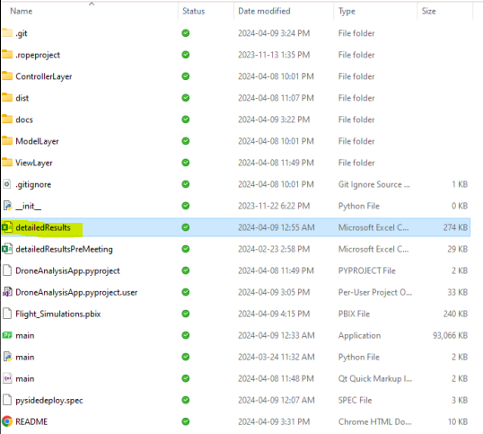
* Once you connect to that data model the Power BI will populate.
* In terms of updating the Power BI in the future all you have to do is press the refresh button, since the model is already connected it is now a very easy process to visualize the simulated flight data.